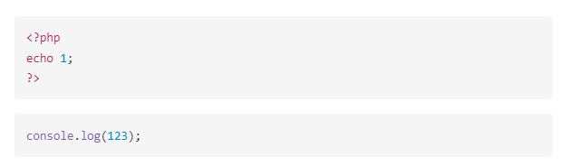

## Plugin

    - Markdown All in Once
    - Markdown Preview Enhanced


## Formatting

**Bôi đậm**
*In nghiêng*
~~Gạch ngang~~
> Đây là một quotation
> Một đoạn văn `thông thường`


## Table

| #   | Title 1   | Title 2            | Number |
| --- | --------- | :----------------- | -----: |
| 1   | Content 1 | Content 2          |      4 |
| 2   | Content 1 | Thi is a long line |      4 |
| 3   | Content 1 | Content 2          |      4 |


## Code style

```php
<?php
echo 1;
?>
```

```js
console.log(123);
```


## Hình ảnh




## Công thức toán
$y = x^2$


## Import file

@import "./files/sample.csv"
